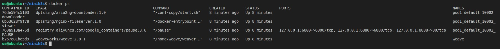
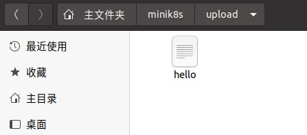
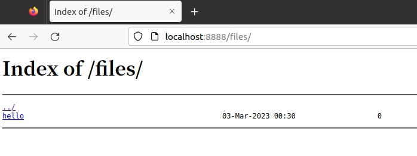
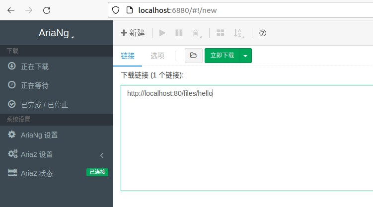
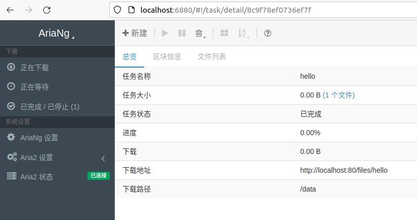
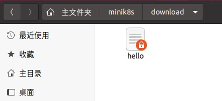

## PodNetwork & Volume

### 1. Pod 配置

配置文件为 `yaml/pod1.yaml`：

```yaml
kind: Pod
metadata:
  name: pod1
  namespace: default
  labels:
    app: myApp
spec:
  restartPolicy: Always
  containers:
    - name: viewer
      image: dplsming/nginx-fileserver:1.0
      ports:
        - containerPort: 80
          hostPort: 8888
      volumeMounts:
        - name: upload
          mountPath: /usr/share/nginx/html/files
    - name: downloader
      image: dplsming/aria2ng-downloader:1.0
      ports:
        - containerPort: 6800
          hostPort: 6800
        - containerPort: 6880
          hostPort: 6880
      volumeMounts:
        - name: download
          mountPath: /data
  volumes:
    - name: upload
      type: hostPath
      path: /home/os/minik8s/upload
    - name: download
      type: hostPath
      path: /home/os/minik8s/download
```

可见该 Pod 包含两个容器：
- `nginx-fileserver` 是一个基于 nginx 的文件服务器，监听在 80 端口上，映射到主机的 8888 端口，同时其 `/usr/share/nginx/html/files` 目录挂载在主机的 `/home/os/minik8s/upload` 目录下。
- `aria2ng-downloader` 是一个文件下载器，监听在 6880 端口上，映射到主机的 6880 端口，同时其 `/data` 目录挂载在主机的 `/home/os/minik8s/download` 目录下。

### 2. 启动
   
在项目根目录（`/home/os/minik8s`）下运行 `make prepare`（仅在虚拟机启动后第一次运行前需要执行）和 `make testPod`，再输入 `docker ps`，可见该 Pod 的容器（包括 Pause 容器）已经启动。



### 3. 上传文件

在主机的 `/home/os/minik8s/upload` 目录下新建文件 `hello`，然后访问 `nginx-fileserver`，即 `http://localhost:8888`，可见文件 `hello` 已经上传。





这证明了 Volume 挂载功能是正常的。

### 4. 下载文件

访问 `aria2ng-downloader`，即 `http://localhost:6880`，下载文件 `http://localhost:80/files/hello`， 可见文件 `hello` 可以正常下载，且在主机的 `/home/os/minik8s/download` 目录下也能访问到文件 `hello`。







这证明了同一个 Pod 的不同容器是共享 Network Namespace 的，可以通过 `localhost:[containerPort]` 互相访问。